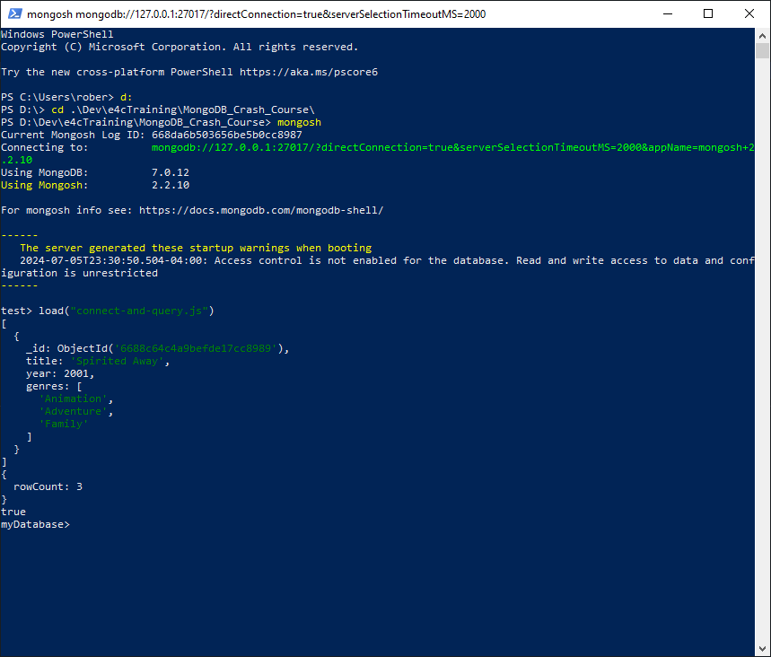
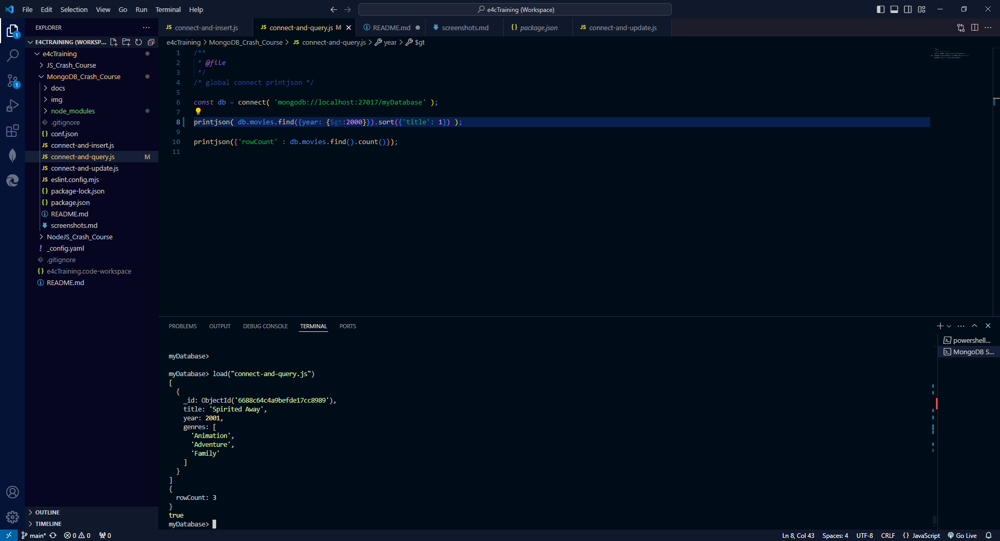
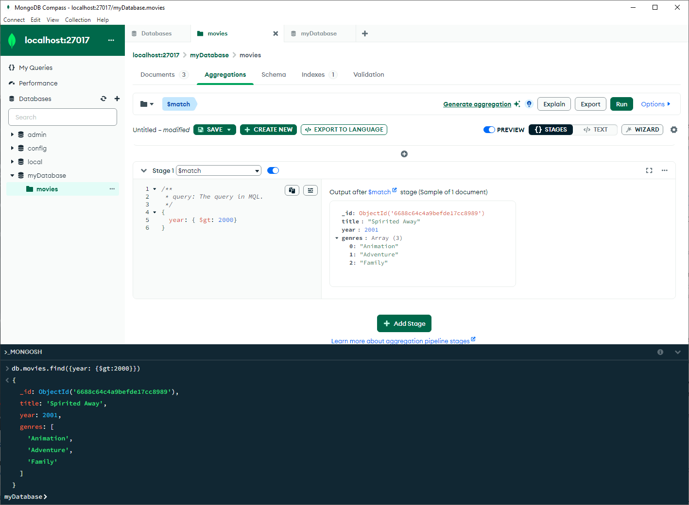
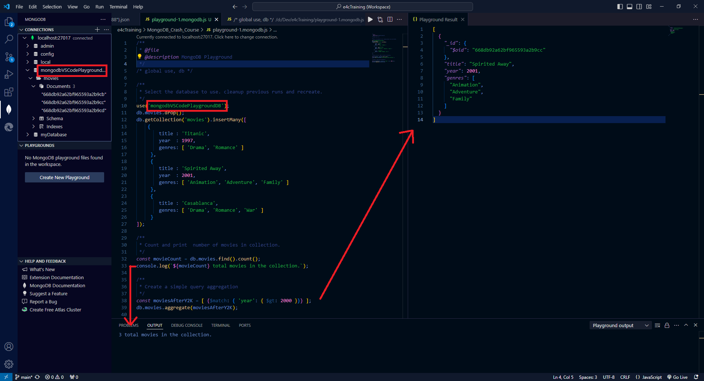
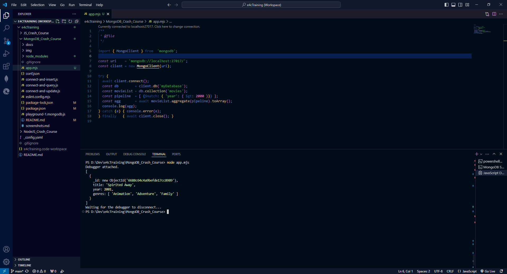

[Home](/) \| [e4c Training](/e4cTraining) \| [MongoDB & Mongoose Tutorials](./)

# MongoDB & Mongoose Screenshots

## MongoSH from Windows PowerShell

## MongoSH from VSCode Terminal Window

## Query Using MongoDB Compass Aggregator

## MongoDB Plugin for VSCode using Playground

## NodeJS Query

